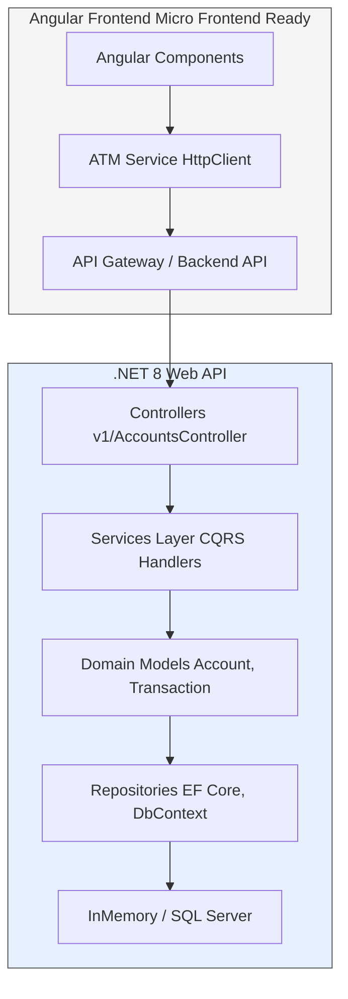
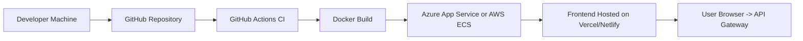

# 🏧 PenChecks ATM Microservice — .NET 8 API + Angular 20 Frontend
This is the PenChecks ATM Application Coding Exercise.

This application is a modern CQRS-styled ATM simulation platform built with:
- **Backend:** ASP.NET Core 8 Web API  
- **Frontend:** Angular 20 (standalone, Vite, SASS)  
- **Database:** EF Core (InMemory)  
- **Architecture:** Clean Architecture / Microservice + Micro Frontend ready  
------------------------------------

### ⚙️ Requirements 
- Create a web-based ATM interface that supports:
- - Deposit funds to an account
- - Withdraw funds from an account
- - Transfer funds between two accounts
- The application should track account balances and transaction history
- Single-user application (no authentication required)

### 🚀 Quick Setup and Run 

### 1. First Run the API 
```bash
cd backend/AtmService.Api
dotnet restore
dotnet run
```
### 2. Next and Last Run the Front-End UI.  
```bash
cd frontend
npm install
ng serve --open
```
### 3. Have Fun!


## 🏗️ Architecture Overview



## 🧩 Project Structure

```
atm/
│
├── backend/
│   ├── AtmService.Api/
│   ├── AtmService.Domain/
│   ├── AtmService.Services/
│   ├── AtmService.Repositories/
│   └── AtmSolution.sln
│
├── frontend/
│   ├── src/
│   │   ├── app/
│   │   │   ├── core/
│   │   │   │   ├── models
│   │   │   │   ├── pipes
│   │   │   │   └── services
│   │   │   └── features/
│   │   └── environments/
│   │       ├── environment.development.ts
│   │       └── environment.production.ts
│   └── angular.json
│
└── README.md
```

## ⚙️ Backend Setup (.NET 8 API)

### 🧰 Prerequisites
- .NET 8 SDK  
- Visual Studio 2022 or VS Code  
- (Optional) SQL Server LocalDB or Azure SQL  

### 🚀 Run the API
```bash
cd backend/AtmService.Api
dotnet restore
dotnet run
```

Default URLs:
- **Swagger UI:** `https://localhost:50000/swagger`
- **API root:** `https://localhost:50000/api/v1/accounts`

### 🧾 Config-driven setup (no hardcoding)

`appsettings.json`
```json
{
  "DatabaseOptions": {
    "Provider": "InMemory",
    "DatabaseName": "AtmDb"
  },
  "SeedData": {
    "Accounts": [
      { "Id": "CHK", "Name": "Checking", "Balance": 1000 },
      { "Id": "SVG", "Name": "Savings", "Balance": 500 }
    ]
  },
  "Cors": {
    "AllowedOrigins": [ "http://localhost:4200" ]
  }
}
```

### 🧱 Environment-based configuration

| Environment | File | Description |
|--------------|------|--------------|
| Development | `appsettings.Development.json` | Uses InMemory database and local CORS |
| Production | `appsettings.Production.json` | Uses SQL Server and restricted CORS |

Switch using:
```bash
set ASPNETCORE_ENVIRONMENT=Development
# or
set ASPNETCORE_ENVIRONMENT=Production
```

### 🧩 Database Setup

By default, it uses EF Core InMemory.  
To use SQL Server, update `appsettings.Production.json`:

```json
"DatabaseOptions": {
  "Provider": "SqlServer",
  "DatabaseName": "AtmDbProd"
},
"ConnectionStrings": {
  "DefaultConnection": "Server=.;Database=AtmDb;Trusted_Connection=True;TrustServerCertificate=True;"
}
```

### 🧱 Example Entity (Account.cs)
```csharp
public class Account
{
    public string Id { get; set; } = default!;
    public string Name { get; set; } = default!;
    public decimal Balance { get; set; }
    public ICollection<Transaction> Transactions { get; set; } = new List<Transaction>();
}
```

## 🖥️ Frontend Setup (Angular 20)

### 🧰 Prerequisites
- Node.js v20+
- Angular CLI 20+

### 🚀 Run the frontend
```bash
cd frontend
npm install
ng serve
```

Open in browser:  
👉 `http://localhost:4200`

### ⚙️ Environment files

#### `environment.development.ts`
```ts
export const environment = {
  production: false,
  apiBaseUrl: 'https://localhost:50000/api/v1'
};
```

#### `environment.production.ts`
```ts
export const environment = {
  production: true,
  apiBaseUrl: 'https://atmapi.example.com/api/v1'
};
```

### 🌈 Example Service (atm-api.service.ts)
```ts
@Injectable({ providedIn: 'root' })
export class AtmApiService {
  constructor(private http: HttpClient) {}
  getAccounts() {
    return this.http.get<Account[]>(`${environment.apiBaseUrl}/accounts`);
  }
  deposit(id: string, amount: number) {
    return this.http.post(`${environment.apiBaseUrl}/accounts/${id}/deposit`, { amount });
  }
}
```

### 💎 Angular Pipes Example
```ts
@Pipe({ name: 'transactionTypeLabel', standalone: true })
export class TransactionTypeLabelPipe implements PipeTransform {
  transform(type: number): string {
    switch (type) {
      case 0: return 'Deposit';
      case 1: return 'Withdraw';
      case 2: return 'Transfer';
      default: return 'Unknown';
    }
  }
}
```

## 🧪 Testing

| Layer | Command |
|-------|----------|
| .NET API | `dotnet test` |
| Angular | `ng test` |

## 🚀 Deployment Overview



## 🔒 Security Notes

- Enforce HTTPS for API in production  
- Set CORS properly in `appsettings.Production.json`  
- Never commit real connection strings or secrets — use environment variables or Azure Key Vault  


## ❤️ Author
**Frank Picon** — Senior Full Stack Engineer  
*Built with .NET 8, Angular 20, and Clean Architecture principles.*
